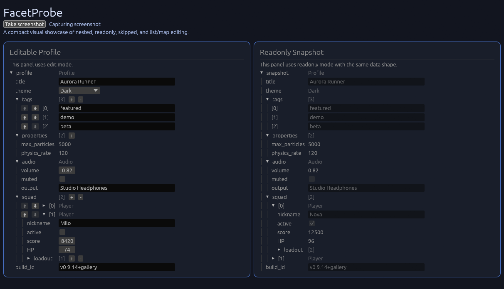

# facet-egui

<p align="center">
  <a href="https://mhc-solutions.de/">
    
  </a>
</p>

> Development of this crate is supported by [**MHC Solutions GmbH**](https://mhc-solutions.de), an engineering company focused on building, industrial, and energy automation whose support for open-source work helps make projects like this possible.

[](https://crates.io/crates/facet-egui)
[](https://docs.rs/facet-egui)
[](https://github.com/Erik1000/facet-egui/actions)
[](../LICENSE-MIT)

An [egui](https://github.com/emilk/egui) inspector/editor widget for any type that implements [`Facet`](https://github.com/facet-rs/facet). Derive `Facet` on your types and get a full property editor with no additional boilerplate.

Versioing follows `egui`s version numbers.

This demonstrates both **editable** and **readonly** modes side-by-side:



Run the gallery example to see `FacetProbe` in action:

```bash
cargo run --example probe_gallery
```

## Example: Complete Type Definition

Here's a complete example demonstrating the types you can inspect and edit:

```rust
use facet::Facet;
use std::collections::BTreeMap;

#[derive(Debug, Facet, Default)]
#[repr(C)]
enum ThemeMode {
    #[default]
    Light,
    Dark,
    Auto,
}

#[derive(Debug, Facet, Default)]
struct Audio {
    volume: f32,
    muted: bool,
    output: String,
}

#[derive(Debug, Facet, Default)]
struct Player {
    nickname: String,
    active: bool,
    score: u64,
    #[facet(facet_egui::rename("HP"))]
    health_points: f32,
    loadout: Vec<String>,
}

#[derive(Debug, Facet)]
struct Profile {
    title: String,
    theme: ThemeMode,
    tags: Vec<String>,
    properties: BTreeMap<String, i32>,
    audio: Audio,
    squad: Vec<Player>,
    #[facet(facet_egui::readonly)]
    build_id: String,
    #[facet(facet_egui::skip)]
    _internal_cache: Vec<u8>,
}
```

## Usage: `FacetProbe` Widget

Creating and displaying a probe is simple:

```rust,no_run
use facet::Facet;
use facet_egui::FacetProbe;

#[derive(Facet)]
struct Data {
  value: i32,
}

fn render(ui: &mut egui::Ui, profile: &mut Data, readonly_data: &Data, data: &mut Data) {
  // In your egui UI function:
  FacetProbe::new(profile)
    .with_id_source("my_probe")
    .with_header("profile")
    .show(ui);

  // For readonly mode:
  FacetProbe::new(readonly_data)
    .with_id_source("readonly_probe")
    .with_header("snapshot")
    .readonly(true)
    .show(ui);

  // Expand all sections by default:
  FacetProbe::new(data)
    .with_header("data")
    .expand_all(true)
    .show(ui);
}
```

## Features

### UI Capabilities

- **Recursive struct/enum/list/map/option inspection and editing** — Navigate arbitrarily nested data structures
- **Enum variant switching via combo box** — Change active enum variant at runtime
- **Option<T> toggle** — Switch between `None` and `Some(T::default())`
- **List manipulation** — Push/pop elements, swap items, inspect collections
- **Map/BTreeMap editing** — Insert and remove key-value pairs
- **Smart pointer traversal** — Transparent navigation through `Arc`, `Rc`, `Box`, etc.
- **Automatic lock handling** — Read from or write to `Arc<RwLock<T>>` and `Arc<Mutex<T>>` with automatic lock acquisition
- **`uuid::Uuid` editing** — Editable/read-only UUID text field (enable the `uuid` feature)
- **Field-level control via attributes** — Per-field customization using `#[facet(egui::...)]`
- **Readonly mode** — Display data without allowing modifications
- **Struct/enum exploration** — Drill down into complex nested types

### Custom Attribute Support

Control field visibility and behavior using `#[facet(...)]` attributes:

- `#[facet(egui::skip)]` — Hide a field from the UI
- `#[facet(egui::readonly)]` — Display field as read-only (no editing)
- `#[facet(egui::rename("Custom Name"))]` — Use a custom display name
- `#[facet(egui::expand_all)]` — Expand all collapsible sections by default
- `#[facet(egui::as_display)]` — Render using the type's `Display` implementation

## `facet` & `facet-reflect` Integration

`facet-egui` is built on top of `facet-reflect` and uses the following key features:

### Core Type System (`facet`)

- **`#[derive(Facet)]`** — Automatic type reflection for structs and enums
- **Shape metadata** — Complete type information including field names, layout, and custom attributes
- **Type definitions** — Type categorization (primitives, pointers, lists, maps, options, sets)
- **Custom attribute grammar** — Extensible attribute system via `#[facet(...)]` macros
- **VTable support** — Dynamic dispatch for operations like list push/pop/swap
- **Pointer introspection** — Detection of smart pointers with lock capability (`Arc<RwLock<T>>`, `Arc<Mutex<T>>`)
- **Default trait detection** — `shape.is_default()` to check if type implements `Default`

### Immutable Reflection (`facet-reflect::Peek`)

- **Type narrowing** — Methods like `peek.into_struct()`, `peek.into_enum()`, `peek.into_list_like()`, `peek.into_map()`, `peek.into_option()`, `peek.into_pointer()`
- **Field iteration** — `fields()` method on structs and enums for safe traversal
- **Collection access** — Length queries and iteration over lists, maps, sets
- **Pointer dereferencing** — `innermost_peek()` for transparent navigation through smart pointers
- **Scalar type detection** — `scalar_type()` for primitive value handling
- **Enum inspection** — Access to active variant and variant fields

### Mutable Reflection (`facet-reflect::Poke`)

- **Mutable access** — `poke.into_struct()`, `poke.into_enum()`, `poke.into_list()`, `poke.into_map()`, `poke.into_option()`
- **Field mutation** — Get mutable references to struct fields and enum variant data
- **List operations** — `push_from_heap()`, `pop()`, `swap()` for vector manipulation
- **Map operations** — `insert_from_heap()` for adding key-value pairs
- **Option mutation** — `set_none()` and `set_some_from_heap()` for option toggling
- **Reborrowing** — `try_reborrow()` to handle transparent wrapper types

### Collection Support

Handles all standard Rust collections transparently:

- **Vectors** — `Vec<T>` with full push/pop/swap support (via `Default` trait provided in a types `VTableDirect`/`VTableIndirect`)
- ~~**Maps** — `BTreeMap<K, V>` and other map types with key-value pair insertion~~ `facet` does not yet implement mutable map types. (`get_mut`)
- ~~**Sets** — Set types with element insertion~~
- **Tuples** — Multi-element tuple reflection and access
- **Options** — `Option<T>` with `None`/`Some` toggling

### Concurrency & Smart Pointers

- **Reference counting** — Transparent `Arc<T>` and `Rc<T>` dereferencing
- **Shared mutability** — `Arc<RwLock<T>>` with automatic read/write lock acquisition
- **Mutex support** — `Arc<Mutex<T>>` for synchronous locking
- **Box & owned pointers** — Transparent navigation through `Box<T>`
- **VTable-based locking** — Dynamic dispatch for lock operations (via `facet-maybe-mut`)

### Type System Capabilities

Supported types include:

- **Primitives** — `bool`, `u32`, `u64`, `i32`, `i64`, `f32`, `f64`, and other scalar types
- **Strings** — `String` (mutable) and `&'static str` (static references)
- **User-defined types** — Any struct or enum with `#[derive(Facet)]`
- **Nested structures** — Arbitrary nesting depth with recursive traversal
- **Transparent wrappers** — Smart pointers, locks, and other wrapper types

## Installation

Add to your `Cargo.toml`:

```toml
[dependencies]
facet = "0.46"
facet-egui = "0.1"
egui = "0.28"
```

Optional: Enable `std` feature for full functionality:

```toml
[dependencies]
facet = { version = "0.46", features = ["std"] }
facet-egui = "0.1"
```

## Status

Work in progress. The API is not stable. 

Due to `facet` not yet providing safe wrapper apis for everything, 
`facet-egui` also contains `unsafe` code which may not be sound.

## Credits

This crate is inspired by the great [`egui-probe`](https://github.com/zakarumych/egui-probe) crate which provides the same (and more) functionality with its own derive macro.

## License

Licensed under either of

- Apache License, Version 2.0 ([LICENSE-APACHE](LICENSE-APACHE) or
  <http://www.apache.org/licenses/LICENSE-2.0)>
- MIT license ([LICENSE-MIT](LICENSE-MIT) or
  <http://opensource.org/licenses/MIT>)

at your option.

## Contribution

Unless you explicitly state otherwise, any contribution intentionally submitted
for inclusion in the work by you, as defined in the Apache-2.0 license, shall be
dual licensed as above, without any additional terms or conditions.
